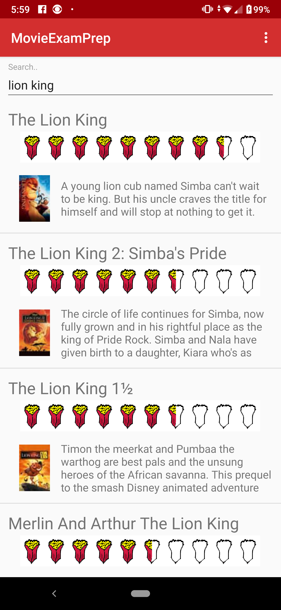

# MovieExamPrep

This project was created in preperation for the [Associate Android Developer Certification Exam](
https://developers.google.com/training/certification/associate-android-developer/).

This app lets the user search for movies by title through [The Movie DB Api](https://api.themoviedb.org) and displays the results in a paginated list. 

The user may click list items to get a description of the movie. The user also has the option to set a reminder for the selected movie, which uses the [Job Scheduler](https://developer.android.com/reference/android/app/job/JobScheduler) to send a notification to the user after at least 5 hours and when the user is connected to WIFI. 

The app supports English, Italian and German and will priortize results based on the current langauge settings (i.e. if German is the selected langauge, movies matching the query that are in German will be at the top of the result list).

A custom view was created to show movie ratings. It extends [RatingBar](https://developer.android.com/reference/android/widget/RatingBar) and shows popcorn bags instead of stars.
